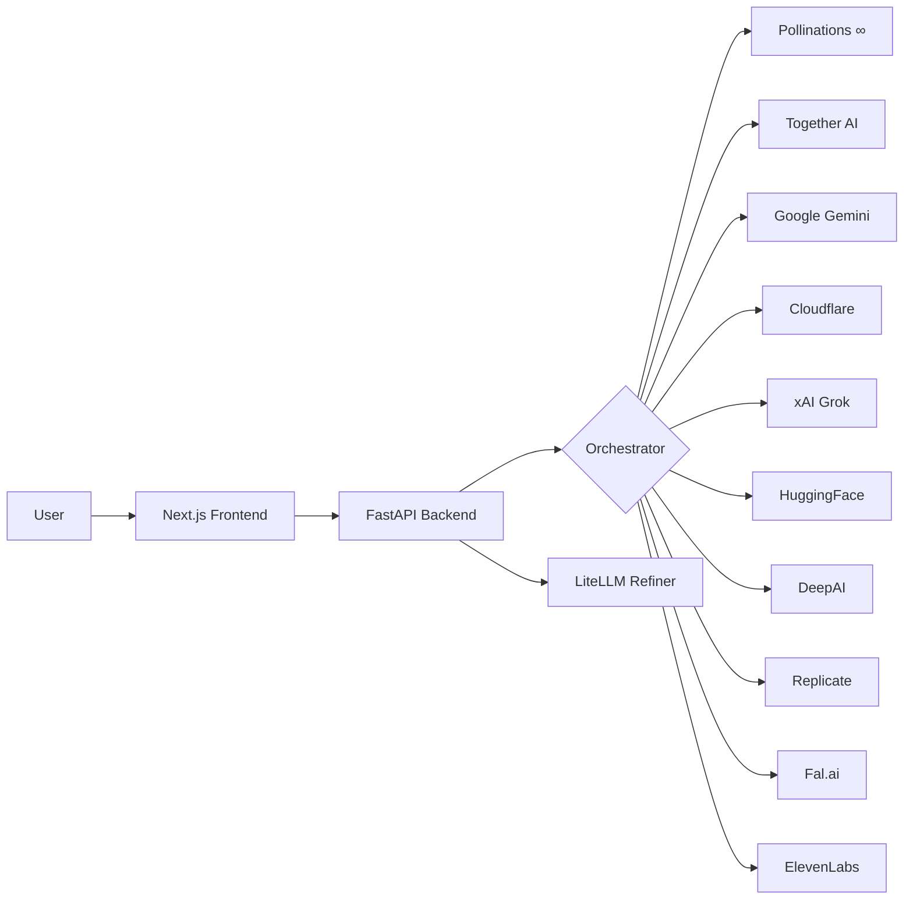
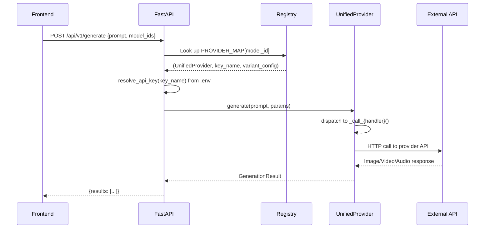
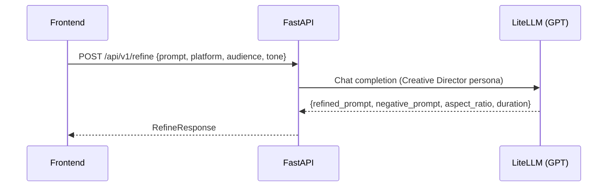

# Confer Marketing Generator — Architecture Plan

## Overview

Confer Marketing Generator is a **free AI-powered marketing asset generator**. Users describe a campaign idea, refine it with an AI Creative Director, and generate images, videos, and audio across multiple free-tier AI providers — all from a single page.



---

## 1. Monorepo Structure

```
pipeline/
├── apps/
│   ├── api/                          # FastAPI backend (Python 3.12+)
│   │   ├── app/
│   │   │   ├── main.py               # FastAPI app, CORS, routes
│   │   │   ├── config.py             # Settings + resolve_api_key()
│   │   │   ├── routes/
│   │   │   │   ├── refine.py         # POST /api/v1/refine
│   │   │   │   └── generate.py       # POST /api/v1/generate
│   │   │   ├── schemas/
│   │   │   │   ├── refine.py         # RefineRequest / RefineResponse
│   │   │   │   └── generate.py       # GenerateRequest / GenerateResponse
│   │   │   ├── providers/
│   │   │   │   ├── base.py           # AbstractProvider (api_key optional)
│   │   │   │   ├── registry.py       # 10-entry PROVIDER_MAP
│   │   │   │   └── unified.py        # Single handler for all 10 providers
│   │   │   └── services/
│   │   │       ├── refiner.py        # LiteLLM prompt refinement
│   │   │       └── orchestrator.py   # Parallel dispatch + server-side keys
│   │   ├── tests/                    # 40+ pytest tests
│   │   ├── .env                      # Free provider API keys
│   │   └── pyproject.toml
│   │
│   └── web/                          # Next.js 15 frontend
│       └── src/
│           ├── app/page.tsx           # Single-page app
│           ├── components/
│           │   ├── confer-header.tsx   # App header
│           │   ├── command-center/     # Prompt + model selection
│           │   └── gallery/            # Results display
│           ├── hooks/
│           │   ├── use-refine.ts       # Prompt refinement hook
│           │   └── use-generate.ts     # Asset generation hook
│           ├── lib/
│           │   ├── api-client.ts       # HTTP client
│           │   └── models.ts           # 10-model roster
│           └── types/index.ts          # TypeScript types
│
├── MODELS.md                          # Provider reference + API key guide
├── PLAN.md                            # This file
├── TASKS.md                           # Execution checklist
├── STATUS.md                          # Status log
└── README.md                          # Project overview
```

---

## 2. Core Concepts

### Free-First Architecture

All generation uses **free or generous-free-tier** APIs. API keys are stored **server-side** in `.env` — the frontend never handles keys.

| Concept | Old (Phases 1-10) | New (Phase 11+) |
|---|---|---|
| API Keys | User pastes in Settings dialog → localStorage → sent in every request | Server `.env` → `resolve_api_key()` → passed to provider |
| Providers | 23 individual Python files, 41 models | 1 unified provider file, 10 models |
| Settings UI | Full API key management modal | Removed entirely |
| Model Selection | Disabled if user hasn't entered key | Always enabled |
| Auth Pattern | BYOK (Bring Your Own Key) | Server-side free keys |

### Provider Dispatch



### Prompt Refinement

The refiner uses a LiteLLM-proxied LLM to transform raw ideas into professional marketing prompts:



---

## 3. Provider Details

| Provider | Handler | Auth | API Pattern | Media |
|---|---|---|---|---|
| Pollinations.ai | `_call_pollinations` | None | GET returns image URL directly | Image |
| Together AI | `_call_together` | Bearer token | OpenAI-compatible `/v1/images/generations` | Image |
| Google Gemini | `_call_gemini` | API key in URL | `:predict` endpoint, base64 response | Image |
| Cloudflare | `_call_cloudflare` | Bearer token | Workers AI `/ai/run/`, returns raw bytes | Image |
| xAI / Grok | `_call_grok` | Bearer token | OpenAI-compatible `/v1/images/generations` | Image |
| Hugging Face | `_call_huggingface` | Bearer token | Model inference, returns raw bytes | Image |
| DeepAI | `_call_deepai` | `api-key` header | Form POST, returns `output_url` | Image |
| Replicate | `_call_replicate` | Bearer token | Create prediction → poll for result | Image |
| Fal.ai | `_call_fal` | `Key` header | Queue submit → poll status → GET result | Video |
| ElevenLabs | `_call_elevenlabs` | `xi-api-key` | TTS POST, returns audio bytes | Audio |

---

## 4. Technology Stack

### Backend
- **Python 3.12+**, FastAPI, Pydantic v2, httpx
- Async throughout (`asyncio.create_task` for parallel dispatch)
- Timeout: 240s global, 180s per-model

### Frontend
- **Next.js 15**, TypeScript, Tailwind CSS, shadcn/ui
- Dark oklch theme, Inter + JetBrains Mono fonts
- Single-page app with no routing needed

---

## 5. Security Model

- API keys stored in server `.env` only — never in frontend
- No key logging or persistence beyond environment
- CORS restricted to `localhost:3000` (dev) 
- Stateless architecture — no sessions, no cookies
